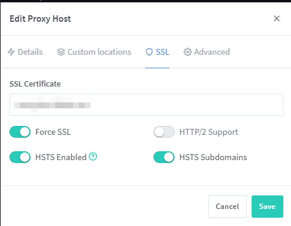
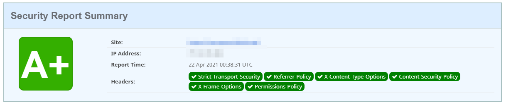

# Nginx Proxy Manager + GoAccess

Reverse proxy with a web UI, built-in Let's Encrypt, custom security headers,
and real-time log analytics via GoAccess.

This folder is the public, reusable stack for [Nginx Proxy Manager](https://nginxproxymanager.com/)
plus [GoAccess](https://goaccess.io/). Operational details of any private homelab
stay out of this repo.


## What this folder contains

| File | Role |
|------|------|
| [`npm-goaccess.yaml`](npm-goaccess.yaml) | Compose stack: NPM (`jc21/nginx-proxy-manager`) + GoAccess |
| [`_hsts.conf`](_hsts.conf) | Custom security-header template mounted into NPM (read-only) |
| [`GoAccess.md`](GoAccess.md) | GoAccess + NPM log formats, sample config, and extra compose notes |
| `image.png`, `image-1.png`, `image-2.png` | Screenshots for the HSTS / header walkthrough below |

## What is a reverse proxy?

A **reverse proxy** sits in front of one or more backend applications and is the
only service that clients (browsers, APIs, mobile apps) talk to on the public
network. Incoming HTTP/HTTPS requests hit the proxy first; the proxy then
forwards each request to the correct internal service and returns the response.

Typical jobs of a reverse proxy:

| Job | Why it matters |
|-----|----------------|
| **TLS termination** | Clients speak HTTPS to the proxy; backends can stay on plain HTTP inside the LAN. |
| **Routing by host or path** | `app.example.com` → one container, `api.example.com` → another, without exposing extra ports. |
| **A single public entry** | Only ports 80/443 need to be published; backends stay on internal networks. |
| **Certificates** | Let's Encrypt (or another ACME issuer) is requested once at the edge. |
| **Headers and security** | HSTS, CSP, and similar headers are applied consistently for every site. |
| **Access logs** | One place to record traffic — which is what GoAccess consumes in this stack. |

Nginx Proxy Manager is a reverse proxy with a web UI on top of Nginx: you define
proxy hosts, SSL, and access lists in the browser instead of editing Nginx
configs by hand. GoAccess reads those access logs and turns them into a live
dashboard.

This is the opposite of a **forward proxy** (used by clients to reach the
Internet). A reverse proxy is used by servers to receive traffic from the
Internet.

## Quick start

1. Copy [`_hsts.conf`](_hsts.conf) to `${NPM_DATA_ROOT}/_hsts.conf` on the host
   (default `/opt/nginx-proxy-manager/_hsts.conf`).
2. Create data directories: `mkdir -p /opt/nginx-proxy-manager/{data,letsencrypt}`
3. Deploy via Portainer or:

   ```bash
   docker compose -f npm-goaccess.yaml up -d
   ```

4. Open the NPM admin UI on port `8181` (default) and create the admin user.
5. Open GoAccess on port `7880` (default) to view the live report.

See [GoAccess.md](GoAccess.md) for log formats, sample `goaccess.conf`, and extra
compose notes. The stack file is [`npm-goaccess.yaml`](npm-goaccess.yaml).

## Environment variables

| Variable | Default | Description |
|----------|---------|-------------|
| `NPM_DATA_ROOT` | `/opt/nginx-proxy-manager` | Persistent NPM data + `_hsts.conf` |
| `NPM_HTTP_PORT` | `8080` | Published HTTP port (container `:80`) |
| `NPM_ADMIN_PORT` | `8181` | NPM admin UI (container `:81`) |
| `NPM_HTTPS_PORT` | `443` | Published HTTPS port |
| `TRAEFIK_LOG_PATH` | `/opt/nginx-proxy-manager/data/logs` | Log directory mounted into GoAccess |
| `LOG_TYPE` | `NPM` | `NPM` or `TRAEFIK` |
| `GOACCESS_PORT` | `7880` | GoAccess web UI port |
| `TZ` | `UTC` | Timezone for GoAccess |

---

## Custom security headers in Nginx Proxy Manager

This section is the original walkthrough for adding custom security headers in
Nginx Proxy Manager (workaround for the UI limitation). Source:
[geekscircuit.com/nginx-proxy-manager](https://geekscircuit.com/nginx-proxy-manager/).

### WTF Security Header?

The Web Application Headers risk vector analyzes security-related fields in the
header section of communications between users and an application. They contain
information about the messages, determine how to receive messages, and how
recipients should respond to a message.

Much like a business letterhead, headers explain where the message is going and
who it is from, date sent, what type of message it is, and other configuration
options. They are included in all back-and-forth communications between
applications. Web servers and web-connected applications must conform to a
certain set of language (communication) standards when sending information over
the Internet. These language definitions are called “protocols.”

Web Application Headers cover security risks posed to an organization's
application users through Hypertext Transfer Protocol (HTTP) headers. HTTP
defines the way a website should respond when it cannot find something, if it
can find something, or something was temporarily moved. For example, the “404”
page (page not found error) can be understood by your web browser thanks to the
HTTP standard. Otherwise, web programmers might pick obscure numbers or other
ways to tell you that a page is not found. Your browser will then have to guess.

Required headers are important for preventing communication attacks, between
applications, from succeeding. Using proper Web Application Headers over the
Internet ensures communications are robust against attacks that are designed to
take advantage of ambiguity (communication details that are not explicitly
defined).

### So what is the risk?

Correctly configured headers protect against malicious behavior, such as
man-in-the-middle (MITM) and cross-site scripting (XSS) attacks, and prevent
attackers from eavesdropping and capturing sensitive data, such as credentials,
corporate email, and customer data.

### How to add headers in Nginx Proxy Manager

Due to a bug it is impossible to add Security Headers to Nginx Proxy Manager
from the UI. Use this workaround:

**Step 1.** Create a file called `_hsts.conf` in your proxy-manager directory
and copy-paste the contents of [`_hsts.conf`](_hsts.conf) from this folder
(or the snippet you want to use).

**Step 2.** Create a volume to this file (read-only). Volume location depends
on the Docker image.

Docker CLI:

```text
# Image: jlesage/nginx-proxy-manager
-v /PROXY-PATH/_hsts.conf:/opt/nginx-proxy-manager/templates/_hsts.conf:ro

# Image: jc21/nginx-proxy-manager
-v /PROXY-PATH/_hsts.conf:/app/templates/_hsts.conf:ro
```

Docker Compose:

```yaml
# Image: jlesage/nginx-proxy-manager
volumes:
  - ./_hsts.conf:/opt/nginx-proxy-manager/templates/_hsts.conf:ro

# Image: jc21/nginx-proxy-manager  (this is what npm-goaccess.yaml uses)
volumes:
  - ./_hsts.conf:/app/templates/_hsts.conf:ro
```

This stack already mounts the file for the `jc21` image:

```yaml
- ${NPM_DATA_ROOT:-/opt/nginx-proxy-manager}/_hsts.conf:/app/templates/_hsts.conf:ro
```

**Step 3.** Go to Nginx Proxy Manager, click **Edit** on the proxy host, open
the **SSL** tab, and enable (or re-enable) **Force SSL**, **HSTS Enabled**, and
**HSTS Subdomains**.



Done. You have added custom security headers to your website. You can verify
the settings with [securityheaders.com](https://securityheaders.com).



Original walkthrough: [geekscircuit.com/nginx-proxy-manager](https://geekscircuit.com/nginx-proxy-manager/).
